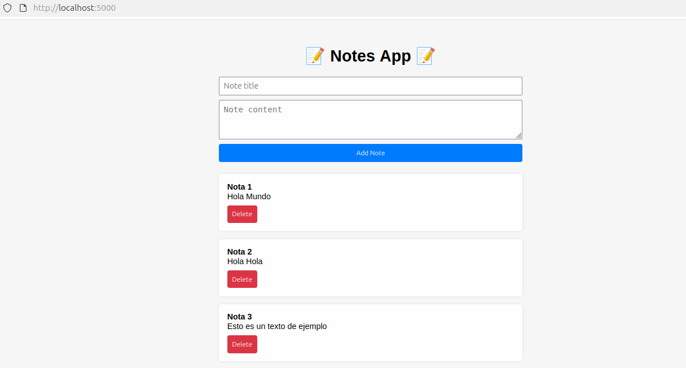
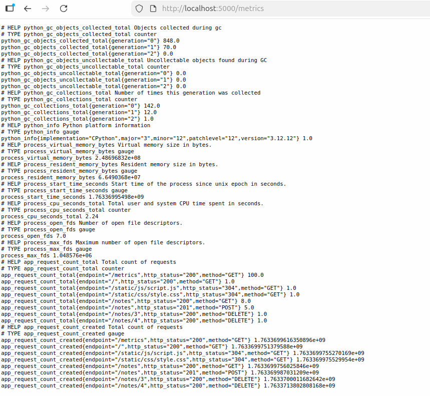
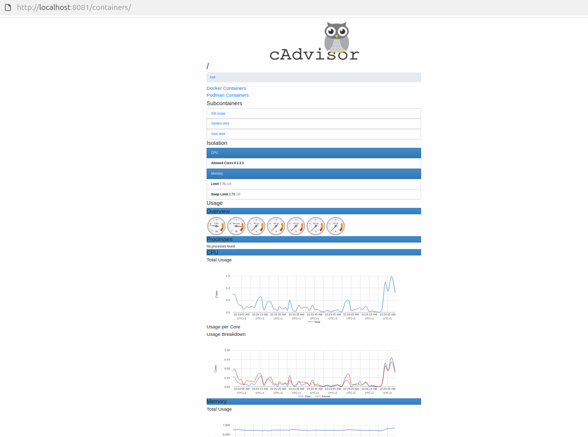
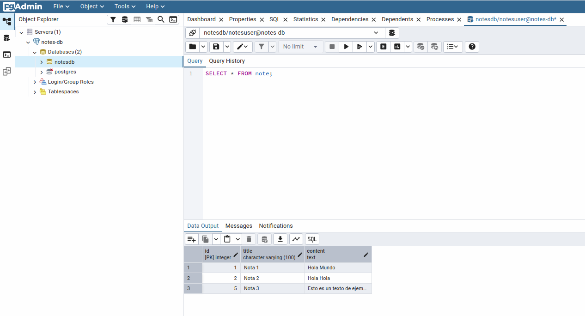
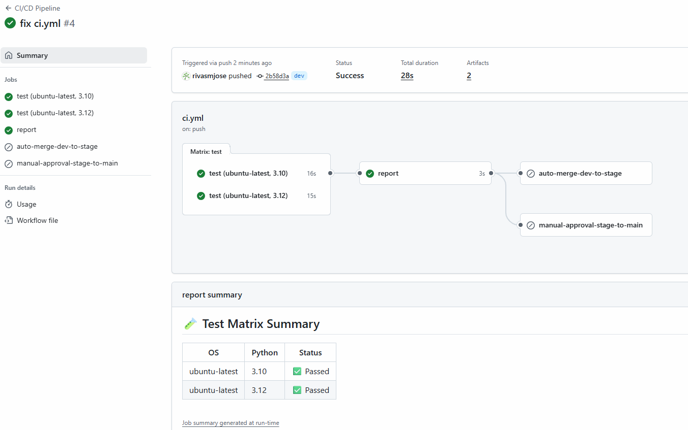
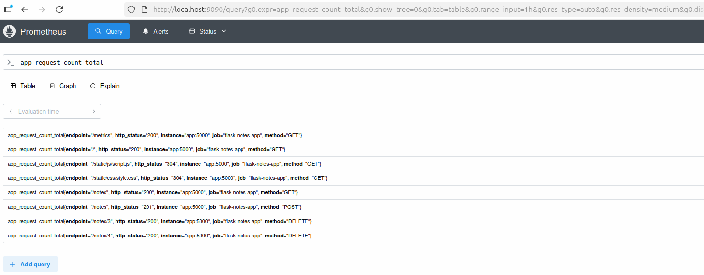
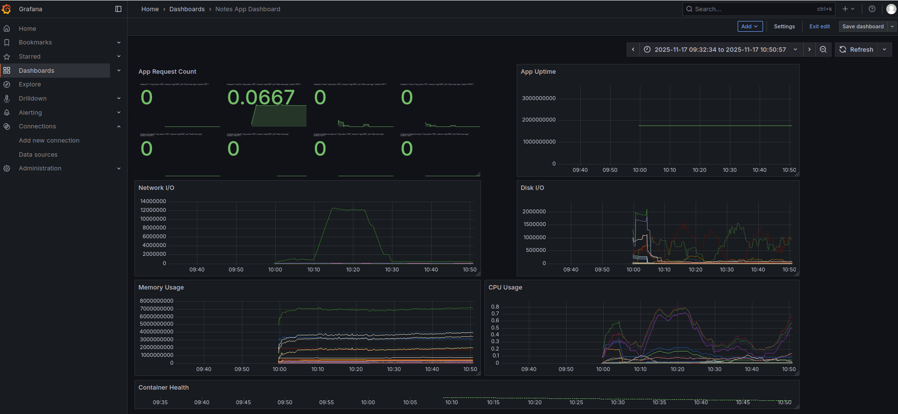

# 🚀 DevOps Final Project – Notes App (Flask + PostgreSQL + Prometheus + Grafana) 🚀


---
---

## 📌 Project Overview

This project demonstrates a complete **DevOps workflow**, including:

- **CI/CD** automation using GitHub Actions
- **Automated testing** (unit tests)
- **Infrastructure as Code (IaC)** with Docker Compose
- **Containerized application** (Python/Flask + PostgreSQL)
- **Database management** (pgAdmin)
- **Monitoring** with Prometheus + Grafana + cAdvisor
- **Environment separation:** *development*, *staging*, *production*

The application is a simple **Notes API** with persistence, metrics, and dashboards.

---
---

## 👥 Team Members

- *(Team member names)*
-
-

---
---

## 🛠️ Technologies Used

| Area | Tools |
|------|-------|
| **Backend** | Python, Flask |
| **Containerization** | Docker, Docker Compose |
| **Database** | PostgreSQL |
| **Database Management** | pgAdmin |
| **CI/CD** | GitHub Actions |
| **Testing** | Pytest |
| **Monitoring** | Prometheus, Grafana, cAdvisor |
| **DevOps Practices** | Makefile, Linting |

---
---

## 🚀 Features

### **Application**
- Flask Notes App
- CRUD API
- PostgreSQL with SQLAlchemy
- `/metrics` endpoint exposing Prometheus counters

### **Infrastructure**
All components are declared in `docker-compose.yml`:
- `app`: Flask microservice
- `db`: PostgreSQL database
- `pgadmin`: for DB administration
- `cAdvisor`: Container advisor to collect CPU, memory filesystem and network usage
- `prometheus`: for metrics scraping
- `grafana`: for dashboards

### **Monitoring**
Prometheus scrapes the Flask app and exposes metrics to Grafana dashboards.

### **Database Administration**
pgAdmin is provided to easily inspect and manage the database.

---
---

## 📂 Project Structure

```text
devops-final-project/
├── .github/workflows/ci.yml        # CI/CD pipeline
├── app/                            # Flask microservice
│   ├── app.py
│   ├── requirements.txt
│   ├── Dockerfile
│   ├── static/                     # Static assets
│   │   ├── css/
│   │   │   └── style.css
│   │   └── js/
│   │       └── script.js
│   └── templates/                  # HTML templates
│       └── index.html
├── tests/                          # Unit tests
│   └── unit_test.py
├── compose.yml                     # Base Compose setup
├── compose.dev.yml                 # Development environment
├── compose.stage.yml               # Staging environment
├── compose.prod.yml                # Production environment
├── prometheus/                     # Prometheus configuration
│   └── prometheus.yml
├── pgadmin/                        # pgAdmin configuration & scripts
│   └── servers.json
├── Makefile                        # Automation commands
└── README.md
```

---
---

## 🧪 Testing

Unit tests are implemented using **pytest** and use mocking for DB operations.

Run tests locally:

```bash
pytest -v  tests/test_unit.py
```

---
---

## 🔄 GitHub Actions CI/CD Pipeline

This GitHub Actions pipeline automates **testing**, **reporting**, and **deployment** for the repository.
The workflow is triggered:

- **On push** to the `dev` branch
- **On pull_request** targeting `stage` or `prod` branches
- **Manually** via `workflow_dispatch` with a configurable environment input

---

### 🔄 Workflow Steps

#### 1️⃣ **Test Job**
Runs on **Ubuntu** with **Python 3.10 and 3.12** using a matrix strategy:

- Checkout the repository
- Print the selected environment
- Set up Python
- Install dependencies from `app/requirements.txt`
- Run `pytest` with coverage reports (**term**, **xml**, **html**)
- Enforce a minimum coverage threshold of **80%**
- Upload coverage reports as artifacts

---

#### 2️⃣ **Report Job**
Runs **after the test job completes** (even if some tests fail):

- Downloads coverage reports from all test jobs
- Generates a consolidated **test matrix summary** for display in the GitHub workflow UI

---

#### 3️⃣ **Auto-Merge Dev → Stage**
Triggered for **pull requests from `dev` to `stage`** after tests pass:

- Automatically merges the PR using **GitHub CLI** if all checks pass

---

#### 4️⃣ **Manual Approval Stage → Prod**
Triggered for **pull requests from `stage` to `prod`**:

- Requires **manual approval** in GitHub UI before deployment
- Associated with the **production environment** and **environment URL**

---
---

## 🏗️ Infrastructure Setup

Start the full environment:

```bash
make build
```

Download all the iamges necessary to be used

```bash
make pull
```

Launch the system
```bash
make up
```

Stop the system
```bash
make down
```

---
---

## Exposed Services

| Service      | URL / Port                  |
|-------------|-----------------------------|
| **Flask App**   | http://localhost5000 |
| **PostgreSQL**  | `localhost:5432`    |
| **pgAdmin**     | http://localhost:8080 |
| **cAdvisor**     | http://localhost:8081 |
| **prometheus**  | http://localhost:9090 |
| **Grafana**     | http://localhost:3000|

---
---

## 🗄️ pgAdmin Configuration

pgAdmin automatically loads server settings from: `pgadmin/servers.json`

### 🔐 Login Credentials
- **Email:** `admin@admin.com`
- **Password:** `admin`

### 🛠️ PostgreSQL Connection Settings
- **Host:** `db`
- **User:** `notesuser`
- **Password:** `notespass` *(must be entered manually)*

---
---

## 📈 Metrics & Why They Matter

| Metric | Importance |
|--------|------------|
| **Request Count** (`flask_http_request_total` or `http_requests_total`) | Tracks traffic and system behavior |
| **Container Health** (`container_last_seen` or `up`) | Ensures reliable deployments |
| **CPU Usage** (`rate(container_cpu_usage_seconds_total[5m])`) | Detects performance bottlenecks |
| **Memory Usage** (`container_memory_usage_bytes`) | Prevents out-of-memory issues |
| **Network I/O** (`rate(container_network_receive_bytes_total[5m])`, `rate(container_network_transmit_bytes_total[5m])`) | Monitors data flow between services |
| **Disk I/O** (`rate(container_fs_reads_bytes_total[5m])`, `rate(container_fs_writes_bytes_total[5m])`) | Tracks storage performance |
| **Uptime** (`process_start_time_seconds`) | Confirms service availability |


---
### 📈 Monitoring

#### 📊 cAdvisor
- **Dashboard**
http://localhost:8081

- **Metrics**
http://localhost:8081/metrics

#### 🔍 Prometheus
- **Access Prometheus at:**
  [http://localhost9090

- **Prometheus scrapes metrics from:**
  `app:5000/metrics`

---

#### 📊 Grafana
- **Access Grafana at:**
  http://localhost:3000

- **Login with:**
  - **User:** `admin`
  - **Password:** `admin`

- **Add Prometheus as a datasource:**
  `http://prometheus:9090`

---
---
## 🧭 API Usage
### ➕ Create a Note
```bash
curl -X POST http://localhost:5000/notes -H "Content-Type: application/json" \
     -d '{"title":"Test","content":"Hello World"}'
```

### 📥 Fetch Notes
```bash
curl http://localhost:5000/notes
```

### 🗑️ Delete a Note
```bash
curl -X DELETE http://localhost:5000/notes/<ID>
```

### 📊 Metrics Endpoint
http://localhost:5000/metrics


---
---
## 📸 Screenshots

**Notes App**



**Notes App metrics**



**cAdvisor**



**pgAdmin**



**GitHub Actions pipeline run**


**Prometheus UI**




**Grafana dashboard**

